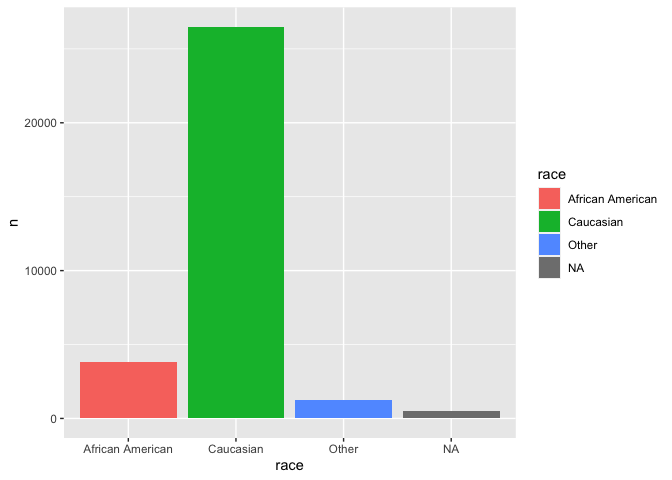
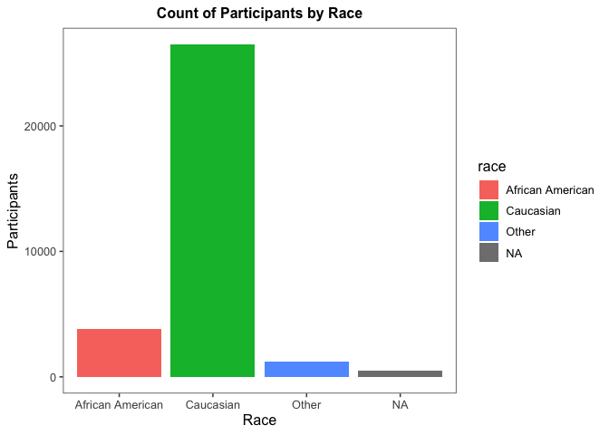
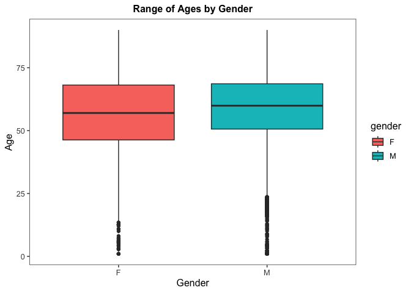
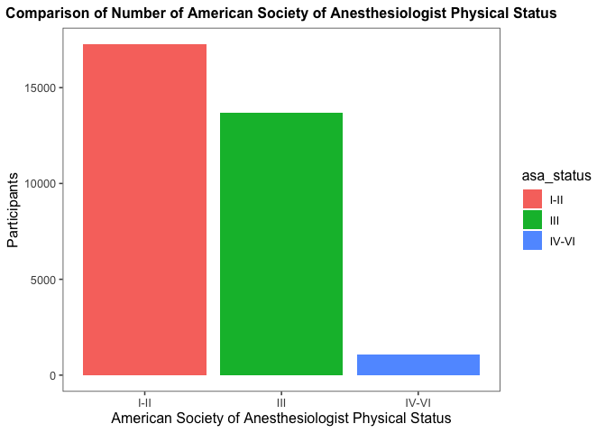
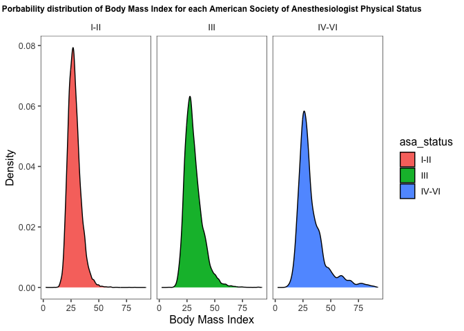
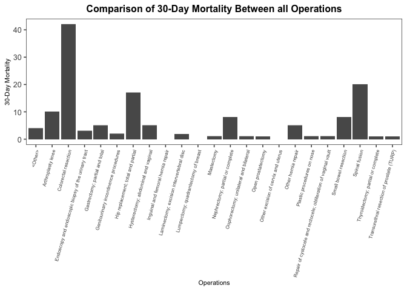
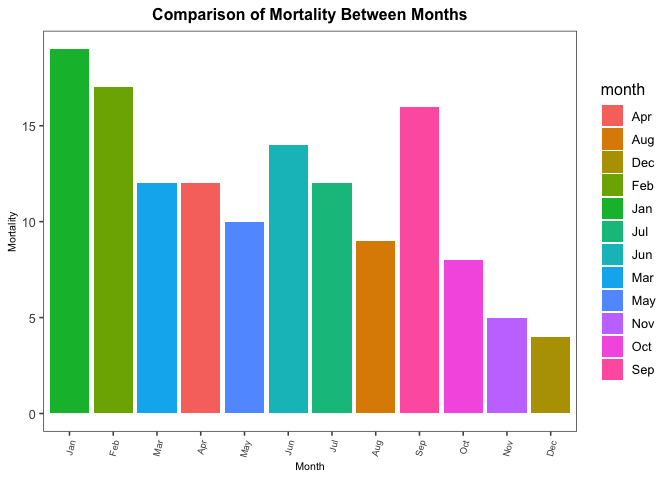

## Instructions
Answer the following questions and complete the exercises in RMarkdown. Please embed all of your code and push your final work to your repository. Your code should be organized, clean, and run free from errors. Remember, you must remove the `#` for any included code chunks to run. Be sure to add your name to the author header above.  

After the first 50 minutes, please upload your code (5 points). During the second 50 minutes, you may get help from each other- but no copy/paste. Upload the last version at the end of this time, but be sure to indicate it as final. If you finish early, you are free to leave.

Make sure to use the formatting conventions of RMarkdown to make your report neat and clean! Use the tidyverse and pipes unless otherwise indicated. To receive full credit, all plots must have clearly labeled axes, a title, and consistent aesthetics. This exam is worth a total of 35 points. 

Please load the following libraries.

```r
library("tidyverse")
library("janitor")
library("naniar")
library("ggthemes")
```

## Data
These data are from a study on surgical residents. The study was originally published by Sessier et al. “Operation Timing and 30-Day Mortality After Elective General Surgery”. Anesth Analg 2011; 113: 1423-8. The data were cleaned for instructional use by Amy S. Nowacki, “Surgery Timing Dataset”, TSHS Resources Portal (2016). Available at https://www.causeweb.org/tshs/surgery-timing/.

Descriptions of the variables and the study are included as pdf's in the data folder.  

Please run the following chunk to import the data.

```r
surgery <- read_csv("data/surgery.csv")
```

1. (2 points) Use the summary function(s) of your choice to explore the data and get an idea of its structure. Please also check for NA's.


```r
glimpse(surgery)
```

```
## Rows: 32,001
## Columns: 25
## $ ahrq_ccs            <chr> "<Other>", "<Other>", "<Other>", "<Other>", "<Othe…
## $ age                 <dbl> 67.8, 39.5, 56.5, 71.0, 56.3, 57.7, 56.6, 64.2, 66…
## $ gender              <chr> "M", "F", "F", "M", "M", "F", "M", "F", "M", "F", …
## $ race                <chr> "Caucasian", "Caucasian", "Caucasian", "Caucasian"…
## $ asa_status          <chr> "I-II", "I-II", "I-II", "III", "I-II", "I-II", "IV…
## $ bmi                 <dbl> 28.04, 37.85, 19.56, 32.22, 24.32, 40.30, 64.57, 4…
## $ baseline_cancer     <chr> "No", "No", "No", "No", "Yes", "No", "No", "No", "…
## $ baseline_cvd        <chr> "Yes", "Yes", "No", "Yes", "No", "Yes", "Yes", "Ye…
## $ baseline_dementia   <chr> "No", "No", "No", "No", "No", "No", "No", "No", "N…
## $ baseline_diabetes   <chr> "No", "No", "No", "No", "No", "No", "Yes", "No", "…
## $ baseline_digestive  <chr> "Yes", "No", "No", "No", "No", "No", "No", "No", "…
## $ baseline_osteoart   <chr> "No", "No", "No", "No", "No", "No", "No", "No", "N…
## $ baseline_psych      <chr> "No", "No", "No", "No", "No", "Yes", "No", "No", "…
## $ baseline_pulmonary  <chr> "No", "No", "No", "No", "No", "No", "No", "No", "N…
## $ baseline_charlson   <dbl> 0, 0, 0, 0, 0, 0, 2, 0, 1, 2, 0, 1, 0, 0, 0, 0, 0,…
## $ mortality_rsi       <dbl> -0.63, -0.63, -0.49, -1.38, 0.00, -0.77, -0.36, -0…
## $ complication_rsi    <dbl> -0.26, -0.26, 0.00, -1.15, 0.00, -0.84, -1.34, 0.0…
## $ ccsmort30rate       <dbl> 0.0042508, 0.0042508, 0.0042508, 0.0042508, 0.0042…
## $ ccscomplicationrate <dbl> 0.07226355, 0.07226355, 0.07226355, 0.07226355, 0.…
## $ hour                <dbl> 9.03, 18.48, 7.88, 8.80, 12.20, 7.67, 9.53, 7.52, …
## $ dow                 <chr> "Mon", "Wed", "Fri", "Wed", "Thu", "Thu", "Tue", "…
## $ month               <chr> "Nov", "Sep", "Aug", "Jun", "Aug", "Dec", "Apr", "…
## $ moonphase           <chr> "Full Moon", "New Moon", "Full Moon", "Last Quarte…
## $ mort30              <chr> "No", "No", "No", "No", "No", "No", "No", "No", "N…
## $ complication        <chr> "No", "No", "No", "No", "No", "No", "No", "Yes", "…
```

```r
summary(surgery)
```

```
##    ahrq_ccs              age           gender              race          
##  Length:32001       Min.   : 1.00   Length:32001       Length:32001      
##  Class :character   1st Qu.:48.20   Class :character   Class :character  
##  Mode  :character   Median :58.60   Mode  :character   Mode  :character  
##                     Mean   :57.66                                        
##                     3rd Qu.:68.30                                        
##                     Max.   :90.00                                        
##                     NA's   :2                                            
##   asa_status             bmi        baseline_cancer    baseline_cvd      
##  Length:32001       Min.   : 2.15   Length:32001       Length:32001      
##  Class :character   1st Qu.:24.60   Class :character   Class :character  
##  Mode  :character   Median :28.19   Mode  :character   Mode  :character  
##                     Mean   :29.45                                        
##                     3rd Qu.:32.81                                        
##                     Max.   :92.59                                        
##                     NA's   :3290                                         
##  baseline_dementia  baseline_diabetes  baseline_digestive baseline_osteoart 
##  Length:32001       Length:32001       Length:32001       Length:32001      
##  Class :character   Class :character   Class :character   Class :character  
##  Mode  :character   Mode  :character   Mode  :character   Mode  :character  
##                                                                             
##                                                                             
##                                                                             
##                                                                             
##  baseline_psych     baseline_pulmonary baseline_charlson mortality_rsi    
##  Length:32001       Length:32001       Min.   : 0.000    Min.   :-4.4000  
##  Class :character   Class :character   1st Qu.: 0.000    1st Qu.:-1.2400  
##  Mode  :character   Mode  :character   Median : 0.000    Median :-0.3000  
##                                        Mean   : 1.184    Mean   :-0.5316  
##                                        3rd Qu.: 2.000    3rd Qu.: 0.0000  
##                                        Max.   :13.000    Max.   : 4.8600  
##                                                                           
##  complication_rsi  ccsmort30rate      ccscomplicationrate      hour      
##  Min.   :-4.7200   Min.   :0.000000   Min.   :0.01612     Min.   : 6.00  
##  1st Qu.:-0.8400   1st Qu.:0.000789   1st Qu.:0.08198     1st Qu.: 7.65  
##  Median :-0.2700   Median :0.002764   Median :0.10937     Median : 9.65  
##  Mean   :-0.4091   Mean   :0.004312   Mean   :0.13325     Mean   :10.38  
##  3rd Qu.: 0.0000   3rd Qu.:0.007398   3rd Qu.:0.18337     3rd Qu.:12.72  
##  Max.   :13.3000   Max.   :0.016673   Max.   :0.46613     Max.   :19.00  
##                                                                          
##      dow               month            moonphase            mort30         
##  Length:32001       Length:32001       Length:32001       Length:32001      
##  Class :character   Class :character   Class :character   Class :character  
##  Mode  :character   Mode  :character   Mode  :character   Mode  :character  
##                                                                             
##                                                                             
##                                                                             
##                                                                             
##  complication      
##  Length:32001      
##  Class :character  
##  Mode  :character  
##                    
##                    
##                    
## 
```

```r
surgery %>%  summarise_all(~(sum(is.na(.))))
```

```
## # A tibble: 1 × 25
##   ahrq_ccs   age gender  race asa_status   bmi baselin…¹ basel…² basel…³ basel…⁴
##      <int> <int>  <int> <int>      <int> <int>     <int>   <int>   <int>   <int>
## 1        0     2      3   480          8  3290         0       0       0       0
## # … with 15 more variables: baseline_digestive <int>, baseline_osteoart <int>,
## #   baseline_psych <int>, baseline_pulmonary <int>, baseline_charlson <int>,
## #   mortality_rsi <int>, complication_rsi <int>, ccsmort30rate <int>,
## #   ccscomplicationrate <int>, hour <int>, dow <int>, month <int>,
## #   moonphase <int>, mort30 <int>, complication <int>, and abbreviated variable
## #   names ¹​baseline_cancer, ²​baseline_cvd, ³​baseline_dementia,
## #   ⁴​baseline_diabetes
```

```r
naniar::miss_var_summary(surgery)
```

```
## # A tibble: 25 × 3
##    variable          n_miss pct_miss
##    <chr>              <int>    <dbl>
##  1 bmi                 3290 10.3    
##  2 race                 480  1.50   
##  3 asa_status             8  0.0250 
##  4 gender                 3  0.00937
##  5 age                    2  0.00625
##  6 ahrq_ccs               0  0      
##  7 baseline_cancer        0  0      
##  8 baseline_cvd           0  0      
##  9 baseline_dementia      0  0      
## 10 baseline_diabetes      0  0      
## # … with 15 more rows
```


2. (3 points) Let's explore the participants in the study. Show a count of participants by race AND make a plot that visually represents your output.


```r
race_count <- surgery %>% 
  count(race)
#race_count
```

```r
race_c_plot<- race_count %>% 
  ggplot(aes(x=race, y=n, fill = `race`))+
  geom_col()
race_c_plot
```

<!-- -->

```r
race_c_plot+
  theme_few()+
  theme(plot.title = element_text(size = 12, hjust = 0.5, face = "bold")
        )+
  labs(title ="Count of Participants by Race", x="Race", y="Participants")
```

<!-- -->


3. (2 points) What is the mean age of participants by gender? (hint: please provide a number for each) Since only three participants do not have gender indicated, remove these participants from the data.


```r
avg_age_by_gender <-
  surgery %>% 
  group_by(gender) %>% 
  summarise(mean_age = mean(age, na.rm = T)) %>% 
  filter(gender != is.na(gender))
avg_age_by_gender
```

```
## # A tibble: 2 × 2
##   gender mean_age
##   <chr>     <dbl>
## 1 F          56.7
## 2 M          58.8
```


4. (3 points) Make a plot that shows the range of age associated with gender.

```r
age_gender_plot <- surgery %>% 
  filter(gender != is.na(gender)) %>% 
  ggplot(aes(x= gender, y= age, fill = gender))+
  geom_boxplot(na.rm = T)
#age_gender_plot
```

```r
age_gender_plot+
  theme_few()+
  theme(plot.title = element_text(size = 12, hjust = 0.5, face = "bold")
        )+
  labs(title ="Range of Ages by Gender", x="Gender", y="Age")
```

<!-- -->

5. (2 points) How healthy are the participants? The variable `asa_status` is an evaluation of patient physical status prior to surgery. Lower numbers indicate fewer comorbidities (presence of two or more diseases or medical conditions in a patient). Make a plot that compares the number of `asa_status` I-II, III, and IV-V.


```r
surgery %>% 
  tabyl(asa_status)
```

```
##  asa_status     n      percent valid_percent
##        I-II 17261 0.5393893941    0.53952427
##         III 13677 0.4273928940    0.42749977
##       IV-VI  1055 0.0329677198    0.03297596
##        <NA>     8 0.0002499922            NA
```

```r
asa_status_comparison <- surgery %>% 
  filter(asa_status != is.na(asa_status)) %>% 
  count(asa_status) %>% 
  ggplot(aes(x= asa_status, y =n, fill = asa_status))+
  geom_col()
#asa_status_comparison
```

```r
asa_status_comparison+
  theme_few()+
  theme(plot.title = element_text(size = 12, hjust = 0.5, face = "bold")
        )+
  labs(title ="Comparison of Number of American Society of Anesthesiologist Physical Status", x="American Society of Anesthesiologist Physical Status", y="Participants")
```

<!-- -->


6. (3 points) Create a plot that displays the distribution of body mass index for each `asa_status` as a probability distribution- not a histogram. (hint: use faceting!)

```r
bmi_asa_plot <- surgery %>% 
  filter(asa_status != is.na(asa_status)) %>% 
  ggplot(aes(x=bmi, fill = asa_status))+
  facet_grid(.~asa_status)+
  geom_density(na.rm = T)
#bmi_asa_plot
```

```r
bmi_asa_plot+
  theme_few()+
  theme(plot.title = element_text(size = 9, hjust = 0.5, face = "bold")
        )+
  labs(title ="Porbability distribution of Body Mass Index for each American Society of Anesthesiologist Physical Status", x="Body Mass Index", y="Density")
```

<!-- -->

The variable `ccsmort30rate` is a measure of the overall 30-day mortality rate associated with each type of operation. The variable `ccscomplicationrate` is a measure of the 30-day in-hospital complication rate. The variable `ahrq_ccs` lists each type of operation.  

7. (4 points) What are the 5 procedures associated with highest risk of 30-day mortality AND how do they compare with the 5 procedures with highest risk of complication? (hint: no need for a plot here)


```r
surgery %>% 
  count(ahrq_ccs, ccsmort30rate) %>% 
  slice_max(ccsmort30rate, n=5)
```

```
## # A tibble: 5 × 3
##   ahrq_ccs                                             ccsmort30rate     n
##   <chr>                                                        <dbl> <int>
## 1 Colorectal resection                                       0.0167   2519
## 2 Small bowel resection                                      0.0129    620
## 3 Gastrectomy; partial and total                             0.0127    394
## 4 Endoscopy and endoscopic biopsy of the urinary tract       0.00811   370
## 5 Spinal fusion                                              0.00742  2694
```


```r
surgery %>% 
  count(ahrq_ccs, ccscomplicationrate) %>% 
  slice_max(ccscomplicationrate, n=5)
```

```
## # A tibble: 5 × 3
##   ahrq_ccs                         ccscomplicationrate     n
##   <chr>                                          <dbl> <int>
## 1 Small bowel resection                          0.466   620
## 2 Colorectal resection                           0.312  2519
## 3 Nephrectomy; partial or complete               0.197  2894
## 4 Gastrectomy; partial and total                 0.190   394
## 5 Spinal fusion                                  0.183  2694
```
8. (3 points) Make a plot that compares the `ccsmort30rate` for all listed `ahrq_ccs` procedures.

```r
surgery %>% 
  ggplot(aes(x=ahrq_ccs, y= ccsmort30rate))+
  geom_col(na.rm = T)+
  theme_few()+
  theme(plot.title = element_text(size = 12, hjust= 0.5, face = "bold"),
        axis.title = element_text(size = 8),
        axis.text.x = element_text(angle=75, hjust = 1, size=6))+
  labs(title ="Comparison of 30-Day Mortality Between all Operations", x="Operations", y="30-Day Mortality")
```

<!-- -->

9. (4 points) When is the best month to have surgery? Make a chart that shows the 30-day mortality and complications for the patients by month. `mort30` is the variable that shows whether or not a patient survived 30 days post-operation.


```r
surgery2 <- 
  surgery %>% 
  mutate(mort30 = as.factor(mort30))
```

```r
surgery2 %>% 
  group_by(month) %>% 
  count(mort30, complication) %>% 
  filter(mort30 == "Yes" & complication == "Yes") %>% 
  arrange(-n)
```

```
## # A tibble: 12 × 4
## # Groups:   month [12]
##    month mort30 complication     n
##    <chr> <fct>  <chr>        <int>
##  1 Jan   Yes    Yes              8
##  2 Feb   Yes    Yes              6
##  3 Sep   Yes    Yes              6
##  4 Apr   Yes    Yes              4
##  5 Jun   Yes    Yes              4
##  6 Jul   Yes    Yes              3
##  7 May   Yes    Yes              3
##  8 Nov   Yes    Yes              3
##  9 Aug   Yes    Yes              2
## 10 Mar   Yes    Yes              2
## 11 Oct   Yes    Yes              2
## 12 Dec   Yes    Yes              1
```

10. (4 points) Make a plot that visualizes the chart from question #9. Make sure that the months are on the x-axis. Do a search online and figure out how to order the months Jan-Dec.

```r
surgery2 %>% 
  group_by(month) %>% 
  count(mort30) %>% 
  filter(mort30 == "Yes") %>% 
  ggplot(aes(x=month, y=n, fill = month))+
  geom_col()+ 
  scale_x_discrete(limits = month.abb)+
  theme_few()+
  theme(plot.title = element_text(size = 12, hjust= 0.5, face = "bold"),
        axis.title = element_text(size = 8),
        axis.text.x = element_text(angle=75, hjust = 1, size=7))+
  labs(title ="Comparison of Mortality Between Months", x="Month", y="Mortality")
```

<!-- -->

Please provide the names of the students you have worked with with during the exam:

Ben Ramirez

Please be 100% sure your exam is saved, knitted, and pushed to your github repository. No need to submit a link on canvas, we will find your exam in your repository.
