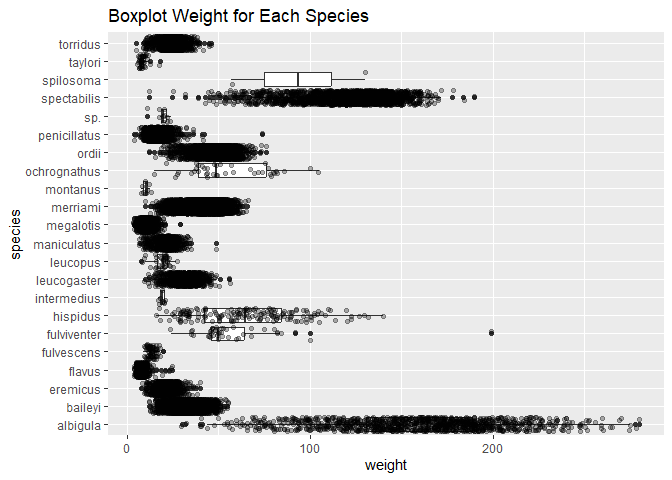

## Instructions
Answer the following questions and complete the exercises in RMarkdown. Please embed all of your code and push your final work to your repository. Your final lab report should be organized, clean, and run free from errors. Remember, you must remove the `#` for the included code chunks to run. Be sure to add your name to the author header above. For any included plots, make sure they are clearly labeled. You are free to use any plot type that you feel best communicates the results of your analysis.  

Make sure to use the formatting conventions of RMarkdown to make your report neat and clean!  

## Load the libraries

```r
library(tidyverse)
library(janitor)
library(here)
library(naniar)
```

## Desert Ecology
For this assignment, we are going to use a modified data set on [desert ecology](http://esapubs.org/archive/ecol/E090/118/). The data are from: S. K. Morgan Ernest, Thomas J. Valone, and James H. Brown. 2009. Long-term monitoring and experimental manipulation of a Chihuahuan Desert ecosystem near Portal, Arizona, USA. Ecology 90:1708.

```r
deserts <- read_csv(here("lab10", "data", "surveys_complete.csv"))
```

```
## Rows: 34786 Columns: 13
## ── Column specification ────────────────────────────────────────────────────────
## Delimiter: ","
## chr (6): species_id, sex, genus, species, taxa, plot_type
## dbl (7): record_id, month, day, year, plot_id, hindfoot_length, weight
## 
## ℹ Use `spec()` to retrieve the full column specification for this data.
## ℹ Specify the column types or set `show_col_types = FALSE` to quiet this message.
```

```r
deserts
```

```
## # A tibble: 34,786 × 13
##    record…¹ month   day  year plot_id speci…² sex   hindf…³ weight genus species
##       <dbl> <dbl> <dbl> <dbl>   <dbl> <chr>   <chr>   <dbl>  <dbl> <chr> <chr>  
##  1        1     7    16  1977       2 NL      M          32     NA Neot… albigu…
##  2        2     7    16  1977       3 NL      M          33     NA Neot… albigu…
##  3        3     7    16  1977       2 DM      F          37     NA Dipo… merria…
##  4        4     7    16  1977       7 DM      M          36     NA Dipo… merria…
##  5        5     7    16  1977       3 DM      M          35     NA Dipo… merria…
##  6        6     7    16  1977       1 PF      M          14     NA Pero… flavus 
##  7        7     7    16  1977       2 PE      F          NA     NA Pero… eremic…
##  8        8     7    16  1977       1 DM      M          37     NA Dipo… merria…
##  9        9     7    16  1977       1 DM      F          34     NA Dipo… merria…
## 10       10     7    16  1977       6 PF      F          20     NA Pero… flavus 
## # … with 34,776 more rows, 2 more variables: taxa <chr>, plot_type <chr>, and
## #   abbreviated variable names ¹​record_id, ²​species_id, ³​hindfoot_length
```

1. Use the function(s) of your choice to get an idea of its structure, including how NA's are treated. Are the data tidy?  


```r
summary(deserts)
```

```
##    record_id         month             day            year         plot_id     
##  Min.   :    1   Min.   : 1.000   Min.   : 1.0   Min.   :1977   Min.   : 1.00  
##  1st Qu.: 8964   1st Qu.: 4.000   1st Qu.: 9.0   1st Qu.:1984   1st Qu.: 5.00  
##  Median :17762   Median : 6.000   Median :16.0   Median :1990   Median :11.00  
##  Mean   :17804   Mean   : 6.474   Mean   :16.1   Mean   :1990   Mean   :11.34  
##  3rd Qu.:26655   3rd Qu.:10.000   3rd Qu.:23.0   3rd Qu.:1997   3rd Qu.:17.00  
##  Max.   :35548   Max.   :12.000   Max.   :31.0   Max.   :2002   Max.   :24.00  
##                                                                                
##   species_id            sex            hindfoot_length     weight      
##  Length:34786       Length:34786       Min.   : 2.00   Min.   :  4.00  
##  Class :character   Class :character   1st Qu.:21.00   1st Qu.: 20.00  
##  Mode  :character   Mode  :character   Median :32.00   Median : 37.00  
##                                        Mean   :29.29   Mean   : 42.67  
##                                        3rd Qu.:36.00   3rd Qu.: 48.00  
##                                        Max.   :70.00   Max.   :280.00  
##                                        NA's   :3348    NA's   :2503    
##     genus             species              taxa            plot_type        
##  Length:34786       Length:34786       Length:34786       Length:34786      
##  Class :character   Class :character   Class :character   Class :character  
##  Mode  :character   Mode  :character   Mode  :character   Mode  :character  
##                                                                             
##                                                                             
##                                                                             
## 
```

```r
naniar::miss_var_summary(deserts)
```

```
## # A tibble: 13 × 3
##    variable        n_miss pct_miss
##    <chr>            <int>    <dbl>
##  1 hindfoot_length   3348     9.62
##  2 weight            2503     7.20
##  3 sex               1748     5.03
##  4 record_id            0     0   
##  5 month                0     0   
##  6 day                  0     0   
##  7 year                 0     0   
##  8 plot_id              0     0   
##  9 species_id           0     0   
## 10 genus                0     0   
## 11 species              0     0   
## 12 taxa                 0     0   
## 13 plot_type            0     0
```


2. How many genera and species are represented in the data? What are the total number of observations? Which species is most/ least frequently sampled in the study?

Total number of observations:

```r
deserts %>% 
  nrow()
```

```
## [1] 34786
```

For genera:

```r
deserts %>% 
  count(genus, sort = T)
```

```
## # A tibble: 26 × 2
##    genus                n
##    <chr>            <int>
##  1 Dipodomys        16167
##  2 Chaetodipus       6029
##  3 Onychomys         3267
##  4 Reithrodontomys   2694
##  5 Peromyscus        2234
##  6 Perognathus       1629
##  7 Neotoma           1252
##  8 Ammospermophilus   437
##  9 Amphispiza         303
## 10 Spermophilus       249
## # … with 16 more rows
```

For species:

```r
deserts %>% 
  count(species, sort = T)
```

```
## # A tibble: 40 × 2
##    species          n
##    <chr>        <int>
##  1 merriami     10596
##  2 penicillatus  3123
##  3 ordii         3027
##  4 baileyi       2891
##  5 megalotis     2609
##  6 spectabilis   2504
##  7 torridus      2249
##  8 flavus        1597
##  9 eremicus      1299
## 10 albigula      1252
## # … with 30 more rows
```

Most frequent species sampled:

```r
deserts %>% 
  count(species, sort = T) %>% 
  slice_max(n)
```

```
## # A tibble: 1 × 2
##   species      n
##   <chr>    <int>
## 1 merriami 10596
```

Least(s) frequent species sampled:

```r
deserts %>% 
  count(species, sort = T) %>% 
  slice_min(n)
```

```
## # A tibble: 6 × 2
##   species          n
##   <chr>        <int>
## 1 clarki           1
## 2 scutalatus       1
## 3 tereticaudus     1
## 4 tigris           1
## 5 uniparens        1
## 6 viridis          1
```

3. What is the proportion of taxa included in this study? Show a table and plot that reflects this count.


```r
tabyl_taxa <- deserts %>% 
  tabyl(taxa)
tabyl_taxa 
```

```
##     taxa     n      percent
##     Bird   450 0.0129362387
##   Rabbit    75 0.0021560398
##  Reptile    14 0.0004024608
##   Rodent 34247 0.9845052607
```

```r
deserts %>% 
  ggplot(aes(x=taxa))+
  geom_bar()+
  scale_y_log10()+
  labs(title="Proportion of Taxa sampled")
```

<!-- -->


4. For the taxa included in the study, use the fill option to show the proportion of individuals sampled by `plot_type.`

```r
deserts %>% 
  ggplot(aes(x=taxa, fill=plot_type))+
  geom_bar(position="dodge")+
  scale_y_log10()+
  labs(title="Proportion of Taxa sampled by Plot Type")
```

<!-- -->

5. What is the range of weight for each species included in the study? Remove any observations of weight that are NA so they do not show up in the plot.


```r
deserts %>% 
  filter(weight!="NA") %>%
  ggplot(aes(x=species, y=weight))+
  geom_boxplot(na.rm = T)+
  coord_flip()+
  labs(title = "Boxplot Weight for Each Species")
```

<!-- -->


6. Add another layer to your answer from #5 using `geom_point` to get an idea of how many measurements were taken for each species.


```r
deserts %>% 
  filter(weight!="NA") %>%
  ggplot(aes(x=species, y=weight))+
  geom_boxplot(na.rm = T)+
  geom_point(position="jitter", alpha =0.3)+
  coord_flip()+
  labs(title = "Boxplot Weight for Each Species")
```

<!-- -->


7. [Dipodomys merriami](https://en.wikipedia.org/wiki/Merriam's_kangaroo_rat) is the most frequently sampled animal in the study. How have the number of observations of this species changed over the years included in the study?


```r
deserts %>% 
  filter(species=="merriami") %>% 
  ggplot(aes(x=year))+
  geom_bar()+
  labs(title="Observation of Merriami Through The Years", x="Year", y="Observations")
```

<!-- -->


8. What is the relationship between `weight` and `hindfoot` length? Consider whether or not over plotting is an issue.


```r
deserts %>% 
  ggplot(aes(x=weight, y=hindfoot_length))+
  geom_point(na.rm = T, position = "jitter", size = 0.5)+
  labs(title="Weight v.s Hindfoot length", x= "Weight", y="Hindfoot Length")
```

<!-- -->


9. Which two species have, on average, the highest weight? Once you have identified them, make a new column that is a ratio of `weight` to `hindfoot_length`. Make a plot that shows the range of this new ratio and fill by sex.


```r
deserts %>% 
  filter(weight > 270) %>% 
  slice_max(weight, n = 2)
```

```
## # A tibble: 2 × 13
##   record_id month   day  year plot_id speci…¹ sex   hindf…² weight genus species
##       <dbl> <dbl> <dbl> <dbl>   <dbl> <chr>   <chr>   <dbl>  <dbl> <chr> <chr>  
## 1     33049    11    17  2001      12 NL      M          33    280 Neot… albigu…
## 2     12871     5    28  1987       2 NL      M          32    278 Neot… albigu…
## # … with 2 more variables: taxa <chr>, plot_type <chr>, and abbreviated
## #   variable names ¹​species_id, ²​hindfoot_length
```

```r
deserts %>% 
  group_by(species) %>% 
  summarise(mean_weight_each_species = mean(weight, na.rm = T)) %>% 
  slice_max(mean_weight_each_species, n=2)
```

```
## # A tibble: 2 × 2
##   species     mean_weight_each_species
##   <chr>                          <dbl>
## 1 albigula                        159.
## 2 spectabilis                     120.
```

```r
deserts %>% 
  filter(species == "albigula" | species == "spectabilis") %>% 
  filter(weight !="NA", hindfoot_length!="NA") %>% 
  mutate(ratio_weight_hindfoot = weight/hindfoot_length)
```

```
## # A tibble: 3,072 × 14
##    record…¹ month   day  year plot_id speci…² sex   hindf…³ weight genus species
##       <dbl> <dbl> <dbl> <dbl>   <dbl> <chr>   <chr>   <dbl>  <dbl> <chr> <chr>  
##  1      357    11    12  1977       9 DS      F          50    117 Dipo… specta…
##  2      362    11    12  1977       1 DS      F          51    121 Dipo… specta…
##  3      367    11    12  1977      20 DS      M          51    115 Dipo… specta…
##  4      377    11    12  1977       9 DS      F          48    120 Dipo… specta…
##  5      381    11    13  1977      17 DS      F          48    118 Dipo… specta…
##  6      383    11    13  1977      11 DS      F          52    126 Dipo… specta…
##  7      385    11    13  1977      17 DS      M          50    132 Dipo… specta…
##  8      392    11    13  1977      11 DS      F          53    122 Dipo… specta…
##  9      394    11    13  1977       4 DS      F          48    107 Dipo… specta…
## 10      398    11    13  1977       4 DS      F          50    115 Dipo… specta…
## # … with 3,062 more rows, 3 more variables: taxa <chr>, plot_type <chr>,
## #   ratio_weight_hindfoot <dbl>, and abbreviated variable names ¹​record_id,
## #   ²​species_id, ³​hindfoot_length
```

```r
deserts %>% 
  filter(species == "albigula" | species == "spectabilis") %>% 
  filter(weight !="NA", hindfoot_length!="NA") %>% 
  mutate(ratio_weight_hindfoot = weight/hindfoot_length) %>% 
  ggplot(aes(x=ratio_weight_hindfoot, fill = sex))+
  geom_boxplot()+
  labs(title="Range of Weight/Hindfoot length ratio between Sex of Albigula and Spectabilis", x="Weight/Hindfoot length")
```

<!-- -->

10. Make one plot of your choice! Make sure to include at least two of the aesthetics options you have learned.

How bave the Weight to hindfoot length ratio of the largest average species changed throughout the years?


```r
deserts %>% 
  filter(species == "albigula") %>% 
  filter(weight !="NA", hindfoot_length!="NA") %>% 
  mutate(ratio_weight_hindfoot = weight/hindfoot_length)
```

```
## # A tibble: 1,046 × 14
##    record…¹ month   day  year plot_id speci…² sex   hindf…³ weight genus species
##       <dbl> <dbl> <dbl> <dbl>   <dbl> <chr>   <chr>   <dbl>  <dbl> <chr> <chr>  
##  1      646     2    20  1978      18 NL      M          32    228 Neot… albigu…
##  2      655     3    11  1978       3 NL      M          32    232 Neot… albigu…
##  3      845     5     6  1978       2 NL      M          32    204 Neot… albigu…
##  4      848     5     6  1978      22 NL      M          32    212 Neot… albigu…
##  5      869     5    17  1978      20 NL      F          33    174 Neot… albigu…
##  6      875     5    17  1978       5 NL      F          33    212 Neot… albigu…
##  7      971     6     8  1978      17 NL      F          32    135 Neot… albigu…
##  8     1029     6     9  1978      18 NL      M          32    232 Neot… albigu…
##  9     1081     7     8  1978      14 NL      M          33    113 Neot… albigu…
## 10     1083     7     8  1978       3 NL      F          34    115 Neot… albigu…
## # … with 1,036 more rows, 3 more variables: taxa <chr>, plot_type <chr>,
## #   ratio_weight_hindfoot <dbl>, and abbreviated variable names ¹​record_id,
## #   ²​species_id, ³​hindfoot_length
```


```r
deserts %>% 
  filter(species == "albigula") %>% 
  filter(weight !="NA", hindfoot_length!="NA") %>% 
  mutate(ratio_weight_hindfoot = weight/hindfoot_length) %>% 
  ggplot(aes(x=year ,y=ratio_weight_hindfoot))+
  geom_col()+
  labs(title = "Albigula Weight/Hindfoot length Ratio Through The Years", x= "Years", y = "Weight/Hindfoot")
```

<!-- -->

```r
deserts %>% 
  filter(species == "albigula") %>% 
  filter(weight !="NA", hindfoot_length!="NA") %>% 
  mutate(ratio_weight_hindfoot = weight/hindfoot_length) %>% 
  ggplot(aes(x=year ,y=ratio_weight_hindfoot, fill=sex))+
  geom_col()+
  labs(title = "Albigula Weight/Hindfoot length Through The Years (Between Sex)", x= "Years", y = "Weight/Hindfoot")
```

<!-- -->

## Push your final code to GitHub!
Please be sure that you check the `keep md` file in the knit preferences. 
