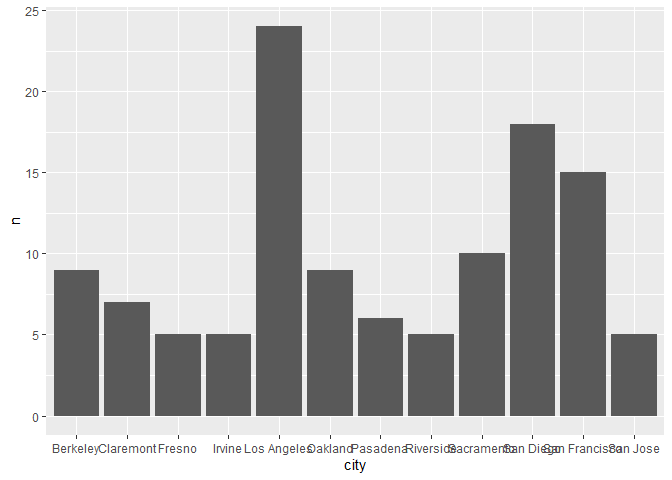
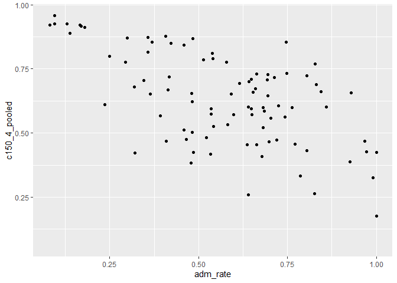
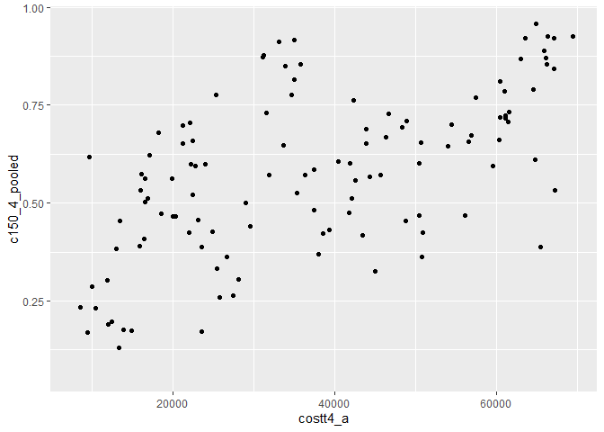

## Instructions
Answer the following questions and complete the exercises in RMarkdown. Please embed all of your code and push your final work to your repository. Your final lab report should be organized, clean, and run free from errors. Remember, you must remove the `#` for the included code chunks to run. Be sure to add your name to the author header above.  

Make sure to use the formatting conventions of RMarkdown to make your report neat and clean!  

## Load the libraries

```r
library(tidyverse)
library(janitor)
library(here)
library(naniar)
```

For this homework, we will take a departure from biological data and use data about California colleges. These data are a subset of the national college scorecard (https://collegescorecard.ed.gov/data/). Load the `ca_college_data.csv` as a new object called `colleges`.

```r
colleges <- read.csv(here("lab9","data", "ca_college_data.csv"))
colleges
```

```
##                                                              INSTNM
## 1                                                 Grossmont College
## 2                                           College of the Sequoias
## 3                                              College of San Mateo
## 4                                                   Ventura College
## 5                                                    Oxnard College
## 6                                                  Moorpark College
## 7                                                   Skyline College
## 8                                        Glendale Community College
## 9                                                    Citrus College
## 10                                              Fresno City College
## 11                                                   Canada College
## 12                                              Bakersfield College
## 13                                                 Foothill College
## 14                                                  Reedley College
## 15                                              Porterville College
## 16                                           Mt San Antonio College
## 17                                            Allan Hancock College
## 18                                          Antelope Valley College
## 19                                                  Palomar College
## 20                                    City College of San Francisco
## 21                                                Santa Ana College
## 22                                     Lake Tahoe Community College
## 23                                          Long Beach City College
## 24                                          College of the Redwoods
## 25                                             Southwestern College
## 26                                       Monterey Peninsula College
## 27                                                MiraCosta College
## 28                                                  Cypress College
## 29                                              Los Medanos College
## 30                                           College of the Canyons
## 31                                          Imperial Valley College
## 32                                                  Gavilan College
## 33                                                  De Anza College
## 34                                                     Yuba College
## 35                                                 Cuyamaca College
## 36                                     Cerro Coso Community College
## 37                                            Diablo Valley College
## 38                                                   Chabot College
## 39                                                    Butte College
## 40                        Mt San Jacinto Community College District
## 41                                             Santa Monica College
## 42                                                Fullerton College
## 43                                        San Diego Miramar College
## 44                                            Pasadena City College
## 45                                                Rio Hondo College
## 46                                               College of Alameda
## 47                                           San Diego City College
## 48                                    Los Angeles Southwest College
## 49                                         Los Angeles City College
## 50                                                 Columbia College
## 51                                           San Diego Mesa College
## 52                              Los Angeles Trade Technical College
## 53                                            Irvine Valley College
## 54                                         Solano Community College
## 55                                           Riverside City College
## 56                                                   Shasta College
## 57                                        Santa Rosa Junior College
## 58                                                     Taft College
## 59                      California State University-Dominguez Hills
## 60                                             Contra Costa College
## 61                                                   Sierra College
## 62                                            Berkeley City College
## 63                                         West Los Angeles College
## 64                          California State University-Los Angeles
## 65                                               Saddleback College
## 66                                           American River College
## 67                                                 College of Marin
## 68                                      West Hills College-Coalinga
## 69                                     California Christian College
## 70                                    San Bernardino Valley College
## 71                                         College of the Siskiyous
## 72                                         Lassen Community College
## 73                                                Mendocino College
## 74                                      Los Angeles Mission College
## 75                                          Sacramento City College
## 76                                              Golden West College
## 77                                       Los Angeles Valley College
## 78                                         East Los Angeles College
## 79                                            College of the Desert
## 80                                           Cosumnes River College
## 81                                                 Cabrillo College
## 82                                            Victor Valley College
## 83                                        Barstow Community College
## 84                                           Modesto Junior College
## 85                                       Los Angeles Pierce College
## 86                                              West Valley College
## 87                                                  Mission College
## 88                                                 Cerritos College
## 89                                                  Merritt College
## 90                                               Palo Verde College
## 91                                                  Chaffey College
## 92                                 El Camino College-Compton Center
## 93                                             Orange Coast College
## 94                                                   Cuesta College
## 95                                                    Laney College
## 96                                                   Merced College
## 97                             El Camino Community College District
## 98                                                 Hartnell College
## 99                                       Santa Barbara City College
## 100                                           San Jose City College
## 101                        Feather River Community College District
## 102                      California State University-San Bernardino
## 103                              California State University-Fresno
## 104                                       San Joaquin Delta College
## 105                                      Los Angeles Harbor College
## 106                         California State University-Bakersfield
## 107                                                  Ohlone College
## 108                          California State University-Stanislaus
## 109                          California State University-Northridge
## 110                                        Evergreen Valley College
## 111                                             Bethesda University
## 112                           California State University-Fullerton
## 113                                             Napa Valley College
## 114                          California State University-Long Beach
## 115                          California State University-Sacramento
## 116                                           Crafton Hills College
## 117                      Santa Barbara Business College-Santa Maria
## 118                      Santa Barbara Business College-Bakersfield
## 119                            California State University-East Bay
## 120                                              Lincoln University
## 121                  California State Polytechnic University-Pomona
## 122                        Shasta Bible College and Graduate School
## 123                                      San Diego State University
## 124                    California State University Maritime Academy
## 125               Southern California University of Health Sciences
## 126                                  San Francisco State University
## 127                               California State University-Chico
## 128                                     Coastline Community College
## 129                                       San Jose State University
## 130                                       Humboldt State University
## 131              Humphreys University-Stockton and Modesto Campuses
## 132                                                Bryan University
## 133                                         Sonoma State University
## 134                                            Life Pacific College
## 135         California Polytechnic State University-San Luis Obispo
## 136                                              Epic Bible College
## 137      Yeshiva Ohr Elchonon Chabad West Coast Talmudical Seminary
## 138                                             National University
## 139                                                Cogswell College
## 140 Argosy University-The Art Institute of California-San Francisco
## 141                      Alliant International University-San Diego
## 142                                    Interior Designers Institute
## 143                                   Design Institute of San Diego
## 144                               Golf Academy of America-San Diego
## 145     Argosy University-The Art Institute of California-San Diego
## 146                              University of California-San Diego
## 147                                 University of California-Irvine
## 148                              University of California-Riverside
## 149                                    Southern California Seminary
## 150                            University of California-Los Angeles
## 151                                              Coleman University
## 152                                  University of California-Davis
## 153                             University of California-Santa Cruz
## 154                               University of California-Berkeley
## 155                          University of California-Santa Barbara
## 156                                      Columbia College Hollywood
## 157                                          Thomas Aquinas College
## 158                                      American Jewish University
## 159                                              Simpson University
## 160                                       Fresno Pacific University
## 161                                       Academy of Art University
## 162                                   Hope International University
## 163                                             Musicians Institute
## 164                                       William Jessup University
## 165  FIDM-Fashion Institute of Design & Merchandising-Orange County
## 166                                           Pacific Union College
## 167                                   California Baptist University
## 168                                            La Sierra University
## 169                                         Platt College-San Diego
## 170                      Vanguard University of Southern California
## 171                                     San Diego Christian College
## 172                            The Master's University and Seminary
## 173  FIDM-Fashion Institute of Design & Merchandising-San Francisco
## 174                                Laguna College of Art and Design
## 175                            Newschool of Architecture and Design
## 176                                     Concordia University-Irvine
## 177    FIDM-Fashion Institute of Design & Merchandising-Los Angeles
## 178                                  Point Loma Nazarene University
## 179                                   American Conservatory Theater
## 180                                        Azusa Pacific University
## 181                                             Woodbury University
## 182                                                Biola University
## 183                                   Mount Saint Mary's University
## 184                                  Notre Dame de Namur University
## 185                                          University of La Verne
## 186                                 Marymount California University
## 187                                           Holy Names University
## 188                   American Academy of Dramatic Arts-Los Angeles
## 189                                                Whittier College
## 190                                  California Lutheran University
## 191                                                   Menlo College
## 192                                  Otis College of Art and Design
## 193                                       University of the Pacific
## 194                                                Westmont College
## 195                                  California College of the Arts
## 196                                                   Mills College
## 197                                     Loyola Marymount University
## 198                             San Francisco Conservatory of Music
## 199                                         University of San Diego
## 200                                     University of San Francisco
## 201                              Saint Mary's College of California
## 202                                    Art Center College of Design
## 203                                          University of Redlands
## 204                                          Santa Clara University
## 205                              California Institute of Technology
## 206                                              Chapman University
## 207                                California Institute of the Arts
## 208                                                  Pomona College
## 209                                     San Francisco Art Institute
## 210                                                  Pitzer College
## 211                                                 Scripps College
## 212                                           Pepperdine University
## 213                                       Claremont McKenna College
## 214                                              Occidental College
## 215                               University of Southern California
## 216                   Southern California Institute of Architecture
## 217                                             Harvey Mudd College
## 218                  Academy of Chinese Culture and Health Sciences
## 219                        The Academy of Radio and TV Broadcasting
## 220                            Avalon School of Cosmetology-Alameda
## 221                           American Baptist Seminary of the West
## 222                            American Film Institute Conservatory
## 223                                         American Beauty College
## 224                             American Career College-Los Angeles
## 225                        Associated Technical College-Los Angeles
## 226                          Associated Technical College-San Diego
## 227                                    Bellus Academy-National City
## 228                                       Brownson Technical School
## 229                                    Phillips Graduate University
## 230                        California Institute of Integral Studies
## 231                University of California-Hastings College of Law
## 232                          University of California-San Francisco
## 233                                                Sofia University
## 234                                        California Beauty School
## 235           Le Cordon Bleu College of Culinary Arts-San Francisco
## 236                                  California Hair Design Academy
## 237                                California Western School of Law
## 238                                        Career Academy of Beauty
## 239                                      Casa Loma College-Van Nuys
## 240                                                   CET-San Diego
## 241                                                    CET-San Jose
## 242                                                   CET-El Centro
## 243                                                      CET-Colton
## 244                                                 CET-Watsonville
## 245                                                     CET-Salinas
## 246               Charles R Drew University of Medicine and Science
## 247                           Church Divinity School of the Pacific
## 248                                   Citrus Heights Beauty College
## 249                                   Claremont Graduate University
## 250                                         Milan Institute-Visalia
## 251                                          Clovis Adult Education
## 252                                                    Coba Academy
## 253                           Western University of Health Sciences
## 254                              International School of Beauty Inc
## 255              Dell'Arte International School of Physical Theatre
## 256                       Dominican School of Philosophy & Theology
## 257                                          Elegance International
## 258              Emperor's College of Traditional Oriental Medicine
## 259                                                  Empire College
## 260                                       Federico Beauty Institute
## 261                                    Fielding Graduate University
## 262                                        Five Branches University
## 263                                  Hair California Beauty Academy
## 264                                    Redondo Beach Beauty College
## 265                                   Franciscan School of Theology
## 266                             Fredrick and Charles Beauty College
## 267                                     Fuller Theological Seminary
## 268                       Gemological Institute of America-Carlsbad
## 269                                         Glendale Career College
## 270                            Golden Gate University-San Francisco
## 271                                      Graduate Theological Union
## 272                                 Salon Success Academy-Riverside
## 273                                           Hilltop Beauty School
## 274                                     Pacifica Graduate Institute
## 275                           Institute for Business and Technology
## 276                    Toni & Guy Hairdressing Academy-Santa Monica
## 277                                         Bellus Academy-El Cajon
## 278                                      John F. Kennedy University
## 279                                         Lancaster Beauty School
## 280                                  Life Chiropractic College West
## 281                                           Loma Linda University
## 282         Los Angeles County College of Nursing and Allied Health
## 283                                                 Lu Ross Academy
## 284                                       Lyle's College of  Beauty
## 285                        Lytles Redwood Empire Beauty College Inc
## 286                                        MTI Business College Inc
## 287                                                     MTI College
## 288                                   Brightwood College-Sacramento
## 289                                    Brightwood College-San Diego
## 290                                        Brightwood College-Vista
## 291                                           Modern Beauty Academy
## 292                         Brightwood College-Los Angeles-Van Nuys
## 293                                            Moler Barber College
## 294       Middlebury Institute of International Studies at Monterey
## 295                                     National Holistic Institute
## 296                                       Newberry School of Beauty
## 297                            North Adrian's College of Beauty Inc
## 298                                       North-West College-Pomona
## 299                                  North-West College-West Covina
## 300                                     North-West College-Pasadena
## 301                                     Oceanside College of Beauty
## 302                               Concorde Career College-San Diego
## 303                                            Palo Alto University
## 304                                            Pacific Oaks College
## 305                                      Pacific School of Religion
## 306                                       Pacific States University
## 307                                Professional Institute of Beauty
## 308                                     Pardee RAND Graduate School
## 309                                    Shasta School of Cosmetology
## 310                                    Salon Success Academy-Upland
## 311                                    Salon Success Academy-Corona
## 312                        Argosy University-San Francisco Bay Area
## 313                                          Rosemead Beauty School
## 314                                  Dongguk University-Los Angeles
## 315                                       Samuel Merritt University
## 316                              San Francisco Theological Seminary
## 317                                      San Joaquin College of Law
## 318                              San Joaquin Valley College-Visalia
## 319                                             Saybrook University
## 320                                        Sierra College of Beauty
## 321                                              Trinity Law School
## 322                     Charles A Jones Career and Education Center
## 323                                          South Baylo University
## 324                                             South Coast College
## 325                            Concorde Career College-Garden Grove
## 326                              Starr King School for the Ministry
## 327                                   Marshall B Ketchum University
## 328                                         Southwestern Law School
## 329                                    Claremont School of Theology
## 330               United Education Institute-Huntington Park Campus
## 331                          Concorde Career College-San Bernardino
## 332                   Universal College of Beauty Inc-Los Angeles 1
## 333                         Concorde Career College-North Hollywood
## 334        The Santa Barbara and Ventura Colleges of Law at Ventura
## 335                                               Walden University
## 336                                        Waynes College of Beauty
## 337                                   Carrington College-Sacramento
## 338                  Westminster Theological Seminary in California
## 339                                            The Wright Institute
## 340               Western State College of Law at Argosy University
## 341                                  Thomas Jefferson School of Law
##                    CITY STABBR        ZIP ADM_RATE SAT_AVG PCIP26 COSTT4_A
## 1              El Cajon     CA 92020-1799       NA      NA 0.0016     7956
## 2               Visalia     CA 93277-2214       NA      NA 0.0066     8109
## 3             San Mateo     CA 94402-3784       NA      NA 0.0038     8278
## 4               Ventura     CA 93003-3872       NA      NA 0.0035     8407
## 5                Oxnard     CA 93033-6699       NA      NA 0.0085     8516
## 6              Moorpark     CA 93021-1695       NA      NA 0.0151     8577
## 7             San Bruno     CA 94066-1698       NA      NA 0.0000     8580
## 8              Glendale     CA 91208-2894       NA      NA 0.0020     9181
## 9              Glendora     CA 91741-1899       NA      NA 0.0021     9281
## 10               Fresno     CA      93741       NA      NA 0.0324     9370
## 11         Redwood City     CA 94061-1099       NA      NA 0.0180     9432
## 12          Bakersfield     CA 93305-1299       NA      NA 0.0305     9472
## 13      Los Altos Hills     CA      94022       NA      NA 0.0080     9612
## 14              Reedley     CA      93654       NA      NA 0.1063     9655
## 15          Porterville     CA      93257       NA      NA 0.0000     9734
## 16               Walnut     CA 91789-1399       NA      NA 0.0000     9758
## 17          Santa Maria     CA 93454-6399       NA      NA 0.0069     9932
## 18            Lancaster     CA 93536-5426       NA      NA 0.0193     9973
## 19           San Marcos     CA 92069-1487       NA      NA 0.0012    10204
## 20        San Francisco     CA 94112-1898       NA      NA 0.0032    10333
## 21            Santa Ana     CA 92706-3398       NA      NA 0.0022    10446
## 22     South Lake Tahoe     CA      96150       NA      NA 0.0000    10476
## 23           Long Beach     CA 90808-1706       NA      NA 0.0364    10568
## 24               Eureka     CA 95501-9300       NA      NA 0.0000    10608
## 25          Chula Vista     CA 91910-7299       NA      NA 0.0098    10713
## 26             Monterey     CA 93940-4799       NA      NA 0.0266    10718
## 27            Oceanside     CA 92056-3899       NA      NA 0.0018    10754
## 28              Cypress     CA 90630-5897       NA      NA 0.0000    10825
## 29            Pittsburg     CA      94565       NA      NA 0.0167    10878
## 30        Santa Clarita     CA 91355-1899       NA      NA 0.0000    10984
## 31             Imperial     CA 92251-0158       NA      NA 0.0012    11077
## 32               Gilroy     CA      95020       NA      NA 0.0031    11111
## 33            Cupertino     CA      95014       NA      NA 0.0133    11144
## 34           Marysville     CA      95901       NA      NA 0.0111    11182
## 35             El Cajon     CA      92019       NA      NA 0.0042    11194
## 36           Ridgecrest     CA 93555-9571       NA      NA 0.0000    11313
## 37        Pleasant Hill     CA      94523       NA      NA 0.0217    11519
## 38              Hayward     CA      94545       NA      NA 0.0331    11583
## 39             Oroville     CA 95965-8399       NA      NA 0.0041    11595
## 40          San Jacinto     CA 92583-2399       NA      NA 0.0000    11634
## 41         Santa Monica     CA 90405-1628       NA      NA 0.0000    11844
## 42            Fullerton     CA 92832-2095       NA      NA 0.0142    11866
## 43            San Diego     CA 92126-2999       NA      NA 0.0630    11912
## 44             Pasadena     CA 91106-2003       NA      NA 0.0000    11958
## 45             Whittier     CA 90601-1616       NA      NA 0.0052    11991
## 46              Alameda     CA      94501       NA      NA 0.0000    12038
## 47            San Diego     CA 92101-4787       NA      NA 0.0362    12068
## 48          Los Angeles     CA 90047-4899       NA      NA 0.0018    12190
## 49          Los Angeles     CA      90029       NA      NA 0.0000    12272
## 50               Sonora     CA      95370       NA      NA 0.0071    12282
## 51            San Diego     CA 92111-4998       NA      NA 0.0423    12382
## 52          Los Angeles     CA 90015-4181       NA      NA 0.0000    12422
## 53               Irvine     CA 92618-0301       NA      NA 0.0012    12449
## 54            Fairfield     CA 94534-3197       NA      NA 0.0051    12558
## 55            Riverside     CA      92506       NA      NA 0.0000    12578
## 56              Redding     CA      96003       NA      NA 0.0000    12745
## 57           Santa Rosa     CA 95401-4395       NA      NA 0.0034    12842
## 58                 Taft     CA      93268       NA      NA 0.0359    12882
## 59               Carson     CA 90747-0005   0.4791      NA 0.0300    13027
## 60            San Pablo     CA 94806-3195       NA      NA 0.0441    13070
## 61              Rocklin     CA 95677-3397       NA      NA 0.0269    13072
## 62             Berkeley     CA      94704       NA      NA 0.0000    13200
## 63          Culver City     CA 90230-3519       NA      NA 0.0029    13369
## 64          Los Angeles     CA 90032-8506   0.6370     870 0.0420    13385
## 65        Mission Viejo     CA 92692-3635       NA      NA 0.0022    13578
## 66           Sacramento     CA 95841-4286       NA      NA 0.0000    13611
## 67            Kentfield     CA 94904-2590       NA      NA 0.0096    13691
## 68             Coalinga     CA      93210       NA      NA 0.0000    13846
## 69               Fresno     CA      93727   1.0000      NA 0.0000    13869
## 70       San Bernardino     CA 92410-2798       NA      NA 0.0069    14005
## 71                 Weed     CA 96094-2899       NA      NA 0.0156    14027
## 72           Susanville     CA      96130       NA      NA 0.0057    14029
## 73                Ukiah     CA      95482       NA      NA 0.0103    14039
## 74               Sylmar     CA 91342-3200       NA      NA 0.0088    14234
## 75           Sacramento     CA 95822-1386       NA      NA 0.0210    14372
## 76     Huntington Beach     CA 92647-2710       NA      NA 0.0067    14397
## 77          Valley Glen     CA 91401-4096       NA      NA 0.0054    14512
## 78        Monterey Park     CA 91754-6099       NA      NA 0.0000    14617
## 79          Palm Desert     CA      92260       NA      NA 0.0089    14656
## 80           Sacramento     CA 95823-5799       NA      NA 0.0217    14679
## 81                Aptos     CA      95003       NA      NA 0.0100    14686
## 82          Victorville     CA 92395-5850       NA      NA 0.0000    14703
## 83              Barstow     CA      92311       NA      NA 0.0000    14789
## 84              Modesto     CA 95350-5800       NA      NA 0.0000    14839
## 85       Woodland Hills     CA 91371-0002       NA      NA 0.0000    14954
## 86             Saratoga     CA 95070-5698       NA      NA 0.0139    14989
## 87          Santa Clara     CA 95054-1897       NA      NA 0.0788    15052
## 88              Norwalk     CA 90650-6298       NA      NA 0.0093    15112
## 89              Oakland     CA 94619-3196       NA      NA 0.0000    15172
## 90               Blythe     CA      92225       NA      NA 0.0000    15185
## 91     Rancho Cucamonga     CA 91737-3002       NA      NA 0.0045    15215
## 92              Compton     CA 90221-5393       NA      NA 0.0000    15261
## 93           Costa Mesa     CA      92626       NA      NA 0.0159    15303
## 94      San Luis Obispo     CA 93403-8106       NA      NA 0.0023    15316
## 95              Oakland     CA      94607       NA      NA 0.0000    15330
## 96               Merced     CA 95348-2898       NA      NA 0.0057    15400
## 97             Torrance     CA      90506       NA      NA 0.0068    15461
## 98              Salinas     CA      93901       NA      NA 0.0073    15859
## 99        Santa Barbara     CA 93109-2394       NA      NA 0.0031    15882
## 100            San Jose     CA 95128-2798       NA      NA 0.0029    15892
## 101              Quincy     CA 95971-9124       NA      NA 0.0153    15907
## 102      San Bernardino     CA 92407-2397   0.5814     877 0.0270    15988
## 103              Fresno     CA      93740   0.5354     907 0.0248    16078
## 104            Stockton     CA      95207       NA      NA 0.0000    16084
## 105          Wilmington     CA 90744-2397       NA      NA 0.0000    16347
## 106         Bakersfield     CA 93311-1099   0.6782      NA 0.0671    16481
## 107             Fremont     CA 94539-0390       NA      NA 0.0133    16547
## 108             Turlock     CA 95382-0299   0.7434      NA 0.0498    16588
## 109          Northridge     CA      91330   0.4824     918 0.0341    16591
## 110            San Jose     CA 95135-1598       NA      NA 0.0031    16732
## 111             Anaheim     CA      92801       NA      NA 0.0000    16877
## 112           Fullerton     CA 92831-3599   0.4823    1017 0.0323    17049
## 113                Napa     CA 94558-6236       NA      NA 0.0000    17068
## 114          Long Beach     CA 90840-0115   0.3189    1052 0.0377    18192
## 115          Sacramento     CA 95819-2694   0.7194     937 0.0251    18535
## 116             Yucaipa     CA 92339-1799       NA      NA 0.0052    18790
## 117         Santa Maria     CA      93454       NA      NA 0.0000    19913
## 118         Bakersfield     CA      93309       NA      NA 0.0000    20028
## 119             Hayward     CA      94542   0.6975      NA 0.0501    20303
## 120             Oakland     CA 94612-2801       NA      NA 0.0000    21195
## 121              Pomona     CA      91768   0.5916    1045 0.0453    21223
## 122             Redding     CA      96002   1.0000      NA 0.0000    22005
## 123           San Diego     CA      92182   0.3464    1132 0.0389    22056
## 124             Vallejo     CA      94590   0.6820      NA 0.0000    22204
## 125            Whittier     CA      90604       NA      NA 0.1364    22229
## 126       San Francisco     CA      94132   0.6820     979 0.0729    22396
## 127               Chico     CA 95929-0150   0.6525     997 0.0239    22417
## 128     Fountain Valley     CA 92708-2597       NA      NA 0.0000    22519
## 129            San Jose     CA 95192-0001   0.5344    1039 0.0251    22780
## 130              Arcata     CA 95521-8299   0.7709     983 0.1135    23139
## 131            Stockton     CA 95207-3896       NA      NA 0.0000    23493
## 132               Tempe     AZ      85281       NA      NA 0.0000    23538
## 133        Rohnert Park     CA 94928-3609   0.7627     990 0.0477    24000
## 134           San Dimas     CA 91773-3298   0.9732     889 0.0000    24838
## 135     San Luis Obispo     CA      93407   0.2949    1270 0.0651    25300
## 136          Sacramento     CA      95841   0.7857      NA 0.0000    25468
## 137         Los Angeles     CA 90046-7660   0.6406      NA 0.0000    25800
## 138            La Jolla     CA 92037-1011       NA      NA 0.0154    26620
## 139            San Jose     CA      95134   0.8256      NA 0.0000    27446
## 140       San Francisco     CA 94102-4908       NA      NA 0.0000    28125
## 141           San Diego     CA      92131   0.8571      NA 0.0000    28258
## 142       Newport Beach     CA      92660       NA      NA 0.0000    28824
## 143           San Diego     CA      92121       NA      NA 0.0000    29002
## 144            Carlsbad     CA      92008       NA      NA 0.0000    29220
## 145           San Diego     CA 92108-4423       NA      NA 0.0000    29567
## 146            La Jolla     CA      92093   0.3566    1324 0.2165    31043
## 147              Irvine     CA      92697   0.4065    1206 0.1073    31198
## 148           Riverside     CA      92521   0.6634    1078 0.1491    31494
## 149            El Cajon     CA 92019-1108       NA      NA 0.0000    31893
## 150         Los Angeles     CA 90095-1405   0.1799    1334 0.1548    33078
## 151           San Diego     CA 92123-1506       NA      NA 0.0000    33695
## 152               Davis     CA 95616-8678   0.4228    1218 0.1975    33904
## 153          Santa Cruz     CA 95064-1011   0.5785    1201 0.1927    34608
## 154            Berkeley     CA      94720   0.1693    1422 0.1053    34924
## 155       Santa Barbara     CA      93106   0.3577    1281 0.1075    34998
## 156             Tarzana     CA 91356-1411   0.5419      NA 0.0000    35282
## 157         Santa Paula     CA      93060   0.7461    1249 0.0000    35724
## 158         Los Angeles     CA 90077-1519   0.5979      NA 0.1000    36286
## 159             Redding     CA 96003-8606   0.5215     985 0.0277    37437
## 160              Fresno     CA 93702-4709   0.6848     968 0.0275    37451
## 161       San Francisco     CA      94105       NA      NA 0.0000    38000
## 162           Fullerton     CA 92831-3199   0.3211     942 0.0000    38570
## 163           Hollywood     CA      90028   0.8047      NA 0.0000    39289
## 164             Rocklin     CA 95765-3707   0.7251    1023 0.0251    40390
## 165              Irvine     CA 92614-5610   0.5399      NA 0.0000    41168
## 166              Angwin     CA 94508-9707   0.4655     986 0.0767    41700
## 167           Riverside     CA 92504-3297   0.6399     988 0.0382    41826
## 168           Riverside     CA 92505-8247   0.4593     906 0.1309    42033
## 169           San Diego     CA 92115-3919       NA      NA 0.0000    42343
## 170          Costa Mesa     CA      92626   0.7024     942 0.0216    42564
## 171              Santee     CA      92071   0.5330     938 0.0575    43473
## 172       Santa Clarita     CA 91321-1200   0.8318    1098 0.0854    43846
## 173       San Francisco     CA 94108-5805   0.3632      NA 0.0000    43881
## 174        Laguna Beach     CA      92651   0.3919      NA 0.0000    44317
## 175           San Diego     CA      92101   0.9908      NA 0.0000    44971
## 176              Irvine     CA 92612-3203   0.6504    1048 0.0617    45687
## 177         Los Angeles     CA 90015-1421   0.4145      NA 0.0000    46291
## 178           San Diego     CA 92106-2899   0.6942    1149 0.0790    46683
## 179       San Francisco     CA 94108-5834       NA      NA 0.0000    47827
## 180               Azusa     CA 91702-7000   0.6146    1035 0.0170    48284
## 181             Burbank     CA 91510-7846   0.6624    1012 0.0000    48733
## 182           La Mirada     CA 90639-0001   0.6485    1093 0.0555    48857
## 183         Los Angeles     CA 90049-1599   0.8592     923 0.0374    50406
## 184             Belmont     CA 94002-1908   0.9668     913 0.1349    50415
## 185            La Verne     CA 91750-4401   0.4806    1040 0.0363    50603
## 186 Rancho Palos Verdes     CA 90275-6299       NA      NA 0.0000    50758
## 187             Oakland     CA 94619-1699   0.4846     888 0.0432    50806
## 188         Los Angeles     CA      90028   0.7701      NA 0.0000    51581
## 189            Whittier     CA      90601   0.6945    1040 0.0795    53966
## 190       Thousand Oaks     CA 91360-2787   0.6419    1107 0.0867    54373
## 191            Atherton     CA 94027-4301   0.4087    1010 0.0000    56035
## 192         Los Angeles     CA 90045-3505   0.9295      NA 0.0000    56519
## 193            Stockton     CA 95211-0197   0.6599    1180 0.1253    56899
## 194       Santa Barbara     CA 93108-1089   0.8276    1171 0.0831    57387
## 195       San Francisco     CA 94107-2247   0.6485      NA 0.0000    59502
## 196             Oakland     CA      94613   0.8441    1109 0.0690    60311
## 197         Los Angeles     CA 90045-2659   0.5387    1244 0.0535    60371
## 198       San Francisco     CA 94102-6011   0.4175      NA 0.0000    60410
## 199           San Diego     CA 92110-2492   0.5138    1237 0.1182    61004
## 200       San Francisco     CA 94117-1080   0.7137    1150 0.0531    61072
## 201              Moraga     CA      94575   0.8039    1093 0.0554    61095
## 202            Pasadena     CA      91103   0.6925      NA 0.0000    61420
## 203            Redlands     CA 92373-0999   0.7475    1101 0.0459    61542
## 204         Santa Clara     CA      95053   0.4830    1321 0.0715    62964
## 205            Pasadena     CA      91125   0.0807    1555 0.0723    63471
## 206              Orange     CA      92866   0.5403    1225 0.0356    64501
## 207            Valencia     CA 91355-2397   0.2360      NA 0.0000    64686
## 208           Claremont     CA 91711-6319   0.0944    1442 0.1711    64870
## 209       San Francisco     CA 94133-2299   0.9261      NA 0.0000    65453
## 210           Claremont     CA 91711-6101   0.1374      NA 0.0888    65880
## 211           Claremont     CA 91711-3905   0.2988    1353 0.1517    66060
## 212              Malibu     CA      90263   0.3687    1251 0.0276    66152
## 213           Claremont     CA 91711-6400   0.0944    1413 0.0681    66325
## 214         Los Angeles     CA 90041-3392   0.4581    1315 0.1373    67046
## 215         Los Angeles     CA      90089   0.1662    1395 0.0461    67064
## 216         Los Angeles     CA 90013-1822       NA      NA 0.0000    67225
## 217           Claremont     CA      91711   0.1287    1496 0.0674    69355
## 218             Oakland     CA      94612       NA      NA     NA       NA
## 219    Huntington Beach     CA      92647       NA      NA 0.0000       NA
## 220             Alameda     CA      94501       NA      NA 0.0000       NA
## 221            Berkeley     CA 94704-3029       NA      NA     NA       NA
## 222         Los Angeles     CA 90027-1625       NA      NA     NA       NA
## 223         West Covina     CA      91790       NA      NA 0.0000       NA
## 224         Los Angeles     CA      90004       NA      NA 0.0000       NA
## 225         Los Angeles     CA 90017-1604       NA      NA 0.0000       NA
## 226           San Diego     CA      92101       NA      NA 0.0000       NA
## 227       National City     CA      91950       NA      NA 0.0000       NA
## 228             Anaheim     CA      92805       NA      NA 0.0000       NA
## 229          Chatsworth     CA      91311       NA      NA     NA       NA
## 230       San Francisco     CA      94103       NA      NA 0.0000       NA
## 231       San Francisco     CA 94102-4978       NA      NA     NA       NA
## 232       San Francisco     CA 94143-0244       NA      NA     NA       NA
## 233           Palo Alto     CA      94303       NA      NA 0.0000       NA
## 234             Modesto     CA      95354       NA      NA 0.0000       NA
## 235       San Francisco     CA      94103       NA      NA 0.0000       NA
## 236             La Mesa     CA 91942-5055       NA      NA 0.0000       NA
## 237           San Diego     CA 92101-3046       NA      NA     NA       NA
## 238        Garden Grove     CA      92845       NA      NA 0.0000       NA
## 239            Van Nuys     CA      91405   0.6031      NA 0.0000       NA
## 240           San Diego     CA      92102       NA      NA 0.0000       NA
## 241            San Jose     CA      95110       NA      NA 0.0000       NA
## 242           El Centro     CA      92243       NA      NA 0.0000       NA
## 243              Colton     CA      92324       NA      NA 0.0000       NA
## 244         Watsonville     CA      95076       NA      NA 0.0000       NA
## 245             Salinas     CA      93901       NA      NA 0.0000       NA
## 246         Los Angeles     CA      90059   0.2500      NA 0.0000       NA
## 247            Berkeley     CA 94709-1211       NA      NA     NA       NA
## 248      Citrus Heights     CA 95610-1410       NA      NA 0.0000       NA
## 249           Claremont     CA 91711-6160       NA      NA     NA       NA
## 250             Visalia     CA      93277       NA      NA 0.0000       NA
## 251              Clovis     CA      93611       NA      NA 0.0000       NA
## 252             Anaheim     CA      92801       NA      NA 0.0000       NA
## 253              Pomona     CA 91766-1854       NA      NA     NA       NA
## 254         Palm Desert     CA 92260-2740       NA      NA 0.0000       NA
## 255           Blue Lake     CA 95525-0816       NA      NA 0.0000       NA
## 256            Berkeley     CA 94708-1816       NA      NA     NA       NA
## 257           Hollywood     CA      90028       NA      NA 0.0000       NA
## 258        Santa Monica     CA      90403       NA      NA     NA       NA
## 259          Santa Rosa     CA 95403-2126       NA      NA 0.0000       NA
## 260          Sacramento     CA      95834       NA      NA 0.0000       NA
## 261       Santa Barbara     CA 93105-3538       NA      NA     NA       NA
## 262          Santa Cruz     CA      95062       NA      NA     NA       NA
## 263              Orange     CA      92867       NA      NA 0.0000       NA
## 264       Redondo Beach     CA 90278-3111       NA      NA 0.0000       NA
## 265           Oceanside     CA      92057       NA      NA     NA       NA
## 266              Eureka     CA      95501       NA      NA 0.0000       NA
## 267            Pasadena     CA      91182       NA      NA     NA       NA
## 268            Carlsbad     CA      92008       NA      NA 0.0000       NA
## 269            Glendale     CA      91203       NA      NA 0.0000       NA
## 270       San Francisco     CA 94105-2968       NA      NA 0.0000       NA
## 271            Berkeley     CA      94709       NA      NA     NA       NA
## 272           Riverside     CA      92506       NA      NA 0.0000       NA
## 273           Daly City     CA      94014       NA      NA 0.0000       NA
## 274         Carpinteria     CA      93013       NA      NA     NA       NA
## 275         Santa Clara     CA 95051-1303       NA      NA 0.0000       NA
## 276        Santa Monica     CA      90401       NA      NA 0.0000       NA
## 277            El Cajon     CA      92021       NA      NA 0.0000       NA
## 278       Pleasant Hill     CA 94523-4817       NA      NA 0.0000       NA
## 279           Lancaster     CA      93534       NA      NA 0.0000       NA
## 280             Hayward     CA 94545-2800       NA      NA     NA       NA
## 281          Loma Linda     CA      92350       NA      NA 0.0000       NA
## 282         Los Angeles     CA 90033-1084       NA      NA 0.0000       NA
## 283             Ventura     CA 93001-2729       NA      NA 0.0000       NA
## 284              Fresno     CA      93710       NA      NA 0.0000       NA
## 285          Santa Rosa     CA      95403       NA      NA 0.0000       NA
## 286            Stockton     CA 95207-4349       NA      NA 0.0000       NA
## 287          Sacramento     CA 95841-9817   0.7725      NA 0.0000       NA
## 288          Sacramento     CA      95821       NA      NA 0.0000       NA
## 289           San Diego     CA      92123       NA      NA 0.0000       NA
## 290               Vista     CA 92083-7736       NA      NA 0.0000       NA
## 291              Oxnard     CA      93030       NA      NA 0.0000       NA
## 292            Van Nuys     CA      91406       NA      NA 0.0000       NA
## 293             Oakland     CA 94609-2419       NA      NA 0.0000       NA
## 294            Monterey     CA      93940       NA      NA 0.0000       NA
## 295          Emeryville     CA 94608-2008       NA      NA 0.0000       NA
## 296       Granada Hills     CA 91344-7401       NA      NA 0.0000       NA
## 297             Modesto     CA 95350-2381       NA      NA 0.0000       NA
## 298              Pomona     CA      91768       NA      NA 0.0000       NA
## 299         West Covina     CA      91790   1.0000      NA 0.0000       NA
## 300            Pasadena     CA      91101       NA      NA 0.0000       NA
## 301           Oceanside     CA 92054-5356       NA      NA 0.0000       NA
## 302           San Diego     CA 92113-1964   1.0000      NA 0.0000       NA
## 303           Palo Alto     CA 94304-1337       NA      NA 0.0000       NA
## 304            Pasadena     CA      91103       NA      NA 0.0000       NA
## 305            Berkeley     CA      94709       NA      NA     NA       NA
## 306         Los Angeles     CA 90010-2263       NA      NA 0.0000       NA
## 307            El Monte     CA      91731       NA      NA 0.0000       NA
## 308        Santa Monica     CA 90407-2138       NA      NA     NA       NA
## 309             Redding     CA      96003       NA      NA 0.0000       NA
## 310              Upland     CA      91786       NA      NA 0.0000       NA
## 311              Corona     CA      92881       NA      NA 0.0000       NA
## 312             Alameda     CA      94501       NA      NA 0.0000       NA
## 313            Rosemead     CA 91770-1639       NA      NA 0.0000       NA
## 314         Los Angeles     CA 90020-1704       NA      NA     NA       NA
## 315             Oakland     CA      94609       NA      NA 0.0000       NA
## 316         San Anselmo     CA 94960-0000       NA      NA     NA       NA
## 317              Clovis     CA 93612-1312       NA      NA     NA       NA
## 318             Visalia     CA 93291-9283       NA      NA 0.0000       NA
## 319             Oakland     CA 94612-1943       NA      NA     NA       NA
## 320              Merced     CA      95340       NA      NA 0.0000       NA
## 321           Santa Ana     CA      92705       NA      NA     NA       NA
## 322          Sacramento     CA 95824-1529       NA      NA 0.0000       NA
## 323             Anaheim     CA 92801-1701       NA      NA 0.0000       NA
## 324              Orange     CA 92868-2609       NA      NA 0.0000       NA
## 325        Garden Grove     CA 92840-9201   0.9046      NA 0.0000       NA
## 326            Berkeley     CA 94709-1209       NA      NA     NA       NA
## 327           Fullerton     CA 92831-1699       NA      NA     NA       NA
## 328         Los Angeles     CA 90010-1106       NA      NA     NA       NA
## 329           Claremont     CA 91711-3199       NA      NA     NA       NA
## 330     Huntington Park     CA      90255       NA      NA 0.0000       NA
## 331      San Bernardino     CA 92408-3403   0.6411      NA 0.0000       NA
## 332         Los Angeles     CA      90044       NA      NA 0.0000       NA
## 333     North Hollywood     CA 91606-3134   0.8805      NA 0.0000       NA
## 334             Ventura     CA      93003       NA      NA     NA       NA
## 335         Minneapolis     MN      55401       NA      NA 0.0000       NA
## 336             Salinas     CA 93906-2830       NA      NA 0.0000       NA
## 337          Sacramento     CA      95826   0.4588      NA 0.0000       NA
## 338           Escondido     CA      92027       NA      NA     NA       NA
## 339            Berkeley     CA 94704-1796       NA      NA     NA       NA
## 340              Irvine     CA 92618-3601       NA      NA     NA       NA
## 341           San Diego     CA      92101       NA      NA     NA       NA
##     C150_4_POOLED PFTFTUG1_EF
## 1              NA      0.3546
## 2              NA      0.5413
## 3              NA      0.3567
## 4              NA      0.3824
## 5              NA      0.2753
## 6              NA      0.4286
## 7          0.2334      0.2307
## 8              NA      0.4209
## 9              NA      0.4399
## 10             NA      0.3657
## 11             NA      0.1658
## 12         0.1704      0.4190
## 13         0.6175      0.2337
## 14             NA      0.4029
## 15             NA      0.5386
## 16             NA      0.4008
## 17             NA      0.3977
## 18         0.2864      0.3841
## 19             NA      0.3470
## 20             NA      0.2489
## 21         0.2313      0.2572
## 22             NA      0.2632
## 23             NA      0.4245
## 24             NA      0.3281
## 25             NA      0.4477
## 26             NA      0.2805
## 27             NA      0.3206
## 28             NA      0.2966
## 29             NA      0.3787
## 30             NA      0.3862
## 31             NA      0.6220
## 32             NA      0.2902
## 33             NA      0.5218
## 34             NA      0.3837
## 35             NA      0.2267
## 36             NA      0.1695
## 37             NA      0.3754
## 38             NA      0.2840
## 39             NA      0.4692
## 40             NA      0.3712
## 41         0.3019      0.4394
## 42             NA      0.3384
## 43             NA      0.1755
## 44             NA      0.4543
## 45         0.1889      0.2402
## 46             NA      0.1380
## 47             NA      0.2120
## 48             NA      0.1517
## 49             NA      0.1436
## 50             NA      0.2780
## 51         0.1973      0.2102
## 52             NA      0.1621
## 53             NA      0.4111
## 54             NA      0.3511
## 55             NA      0.3182
## 56             NA      0.3377
## 57             NA      0.3505
## 58             NA      0.1611
## 59         0.3837      0.3155
## 60             NA      0.2658
## 61             NA      0.3920
## 62             NA      0.2032
## 63         0.1312      0.1439
## 64         0.4553      0.4788
## 65             NA      0.3299
## 66             NA      0.1879
## 67             NA      0.2966
## 68             NA      0.2870
## 69         0.1765      0.1667
## 70             NA      0.3030
## 71             NA      0.5374
## 72             NA      0.1947
## 73             NA      0.3060
## 74             NA      0.2513
## 75             NA      0.1897
## 76             NA      0.2854
## 77             NA      0.1967
## 78             NA      0.2966
## 79             NA      0.4632
## 80             NA      0.2501
## 81             NA      0.4257
## 82             NA      0.4402
## 83             NA      0.2203
## 84         0.1749      0.3457
## 85             NA      0.2820
## 86             NA      0.3636
## 87             NA      0.1905
## 88             NA      0.3305
## 89             NA      0.1195
## 90             NA      0.0813
## 91             NA      0.2967
## 92             NA      0.2451
## 93             NA      0.3890
## 94             NA      0.4262
## 95             NA      0.1402
## 96             NA      0.5094
## 97             NA      0.4392
## 98             NA      0.2314
## 99             NA      0.4097
## 100            NA      0.2312
## 101        0.3898      0.2971
## 102        0.5332      0.5094
## 103        0.5749      0.5792
## 104            NA      0.4831
## 105            NA      0.2565
## 106        0.4074      0.5198
## 107            NA      0.3277
## 108        0.5618      0.5391
## 109        0.5022      0.4937
## 110            NA      0.3287
## 111        0.5111      0.2371
## 112        0.6209      0.4999
## 113            NA      0.3670
## 114        0.6788      0.5128
## 115        0.4734      0.4819
## 116            NA      0.3025
## 117        0.5631      0.3103
## 118        0.4665      0.3071
## 119        0.4654      0.3993
## 120        0.6970      0.8000
## 121        0.6521      0.5408
## 122        0.4255      0.6000
## 123        0.7058      0.5499
## 124        0.5993      0.7045
## 125            NA      1.0000
## 126        0.5218      0.5374
## 127        0.6578      0.6442
## 128            NA      0.0619
## 129        0.5946      0.4265
## 130        0.4561      0.5957
## 131        0.3875      0.1803
## 132        0.1719      0.8227
## 133        0.5993      0.6852
## 134        0.4268      0.4769
## 135        0.7764      0.8474
## 136        0.3333      0.0385
## 137        0.2596      0.7353
## 138        0.3614      0.0064
## 139        0.2641      0.6604
## 140        0.3041      0.3444
## 141            NA          NA
## 142            NA      0.1111
## 143        0.5000      0.1333
## 144            NA      0.0976
## 145        0.4405      0.3953
## 146        0.8724      0.6622
## 147        0.8764      0.7254
## 148        0.7300      0.8111
## 149        0.5714      0.1429
## 150        0.9112      0.6607
## 151        0.6470      0.3448
## 152        0.8502      0.6049
## 153        0.7764      0.7856
## 154        0.9165      0.7087
## 155        0.8157      0.7077
## 156        0.5246      0.6667
## 157        0.8547      0.8700
## 158        0.5714      0.3333
## 159        0.4817      0.4958
## 160        0.5844      0.2331
## 161        0.3699      0.3430
## 162        0.4225      0.4078
## 163        0.4317      0.7019
## 164        0.6049      0.5155
## 165            NA      0.6421
## 166        0.4746      0.7131
## 167        0.6006      0.5478
## 168        0.5114      0.6124
## 169        0.7615      1.0000
## 170        0.5580      0.6846
## 171        0.4179      0.3393
## 172        0.6878      0.6853
## 173        0.6510      0.4250
## 174        0.5680      0.5060
## 175        0.3265      0.3214
## 176        0.5717      0.7148
## 177        0.6671      0.5032
## 178        0.7288      0.6279
## 179            NA          NA
## 180        0.6939      0.6877
## 181        0.4534      0.4821
## 182        0.7095      0.7747
## 183        0.6009      0.6468
## 184        0.4674      0.6215
## 185        0.6550      0.4278
## 186        0.3622      0.6718
## 187        0.4233      0.6552
## 188            NA      0.9205
## 189        0.6445      0.8548
## 190        0.7004      0.6591
## 191        0.4685      0.6255
## 192        0.6568      0.7224
## 193        0.6733      0.8142
## 194        0.7685      0.8618
## 195        0.5954      0.6368
## 196        0.6603      0.6377
## 197        0.8116      0.7789
## 198        0.7176      0.7297
## 199        0.7851      0.7543
## 200        0.7157      0.7822
## 201        0.7240      0.7904
## 202        0.7073      0.5556
## 203        0.7331      0.8136
## 204        0.8668      0.9095
## 205        0.9215      0.9833
## 206        0.7909      0.8029
## 207        0.6109      0.8333
## 208        0.9569      0.9809
## 209        0.3876      0.6354
## 210        0.8883      0.9404
## 211        0.8709      0.9408
## 212        0.8539      0.8156
## 213        0.9245      0.9359
## 214        0.8416      0.9194
## 215        0.9215      0.6786
## 216        0.5327      0.3088
## 217        0.9252      0.9817
## 218            NA          NA
## 219            NA      1.0000
## 220            NA      0.6442
## 221            NA          NA
## 222            NA          NA
## 223            NA      0.7813
## 224            NA      0.4116
## 225            NA      1.0000
## 226            NA      1.0000
## 227            NA      1.0000
## 228            NA      1.0000
## 229            NA          NA
## 230            NA          NA
## 231            NA          NA
## 232            NA          NA
## 233            NA          NA
## 234            NA      0.5849
## 235            NA          NA
## 236            NA      1.0000
## 237            NA          NA
## 238            NA      0.8810
## 239            NA      0.4000
## 240            NA      1.0000
## 241            NA      1.0000
## 242            NA      1.0000
## 243            NA      1.0000
## 244            NA      1.0000
## 245            NA      1.0000
## 246        0.8000          NA
## 247            NA          NA
## 248            NA      1.0000
## 249            NA          NA
## 250            NA      1.0000
## 251            NA      0.4509
## 252            NA      1.0000
## 253            NA          NA
## 254            NA      1.0000
## 255            NA          NA
## 256            NA          NA
## 257            NA      1.0000
## 258            NA          NA
## 259        0.5845      0.4856
## 260            NA      0.8816
## 261            NA          NA
## 262            NA          NA
## 263            NA      0.3571
## 264            NA      1.0000
## 265            NA          NA
## 266            NA      1.0000
## 267            NA          NA
## 268            NA      1.0000
## 269            NA      0.4795
## 270            NA          NA
## 271            NA          NA
## 272            NA      1.0000
## 273            NA      0.4706
## 274            NA          NA
## 275            NA      0.7551
## 276            NA      1.0000
## 277            NA      1.0000
## 278            NA          NA
## 279            NA      1.0000
## 280            NA          NA
## 281            NA          NA
## 282            NA          NA
## 283            NA      1.0000
## 284            NA      0.5000
## 285            NA      1.0000
## 286            NA      1.0000
## 287            NA      0.2997
## 288            NA      0.9091
## 289            NA      0.7241
## 290            NA      0.9590
## 291            NA      1.0000
## 292            NA      0.5529
## 293            NA          NA
## 294            NA          NA
## 295            NA      1.0000
## 296            NA      0.8000
## 297            NA      1.0000
## 298            NA      1.0000
## 299            NA      0.8966
## 300            NA      1.0000
## 301            NA      1.0000
## 302            NA      1.0000
## 303            NA          NA
## 304            NA          NA
## 305            NA          NA
## 306            NA      1.0000
## 307            NA      1.0000
## 308            NA          NA
## 309            NA      1.0000
## 310            NA      0.8372
## 311            NA      1.0000
## 312        0.2222      0.1250
## 313            NA      0.8178
## 314            NA          NA
## 315            NA          NA
## 316            NA          NA
## 317            NA          NA
## 318            NA      0.5325
## 319            NA          NA
## 320            NA      0.8182
## 321            NA          NA
## 322            NA      1.0000
## 323            NA          NA
## 324            NA      0.2174
## 325            NA      1.0000
## 326            NA          NA
## 327            NA          NA
## 328            NA          NA
## 329            NA          NA
## 330            NA      1.0000
## 331            NA      1.0000
## 332            NA      0.6667
## 333            NA      1.0000
## 334            NA          NA
## 335        0.0625          NA
## 336            NA      1.0000
## 337            NA      0.2647
## 338            NA          NA
## 339            NA          NA
## 340            NA          NA
## 341            NA          NA
```

The variables are a bit hard to decipher, here is a key:  

INSTNM: Institution name  
CITY: California city  
STABBR: Location state  
ZIP: Zip code  
ADM_RATE: Admission rate  
SAT_AVG: SAT average score  
PCIP26: Percentage of degrees awarded in Biological And Biomedical Sciences  
COSTT4_A: Annual cost of attendance  
C150_4_POOLED: 4-year completion rate  
PFTFTUG1_EF: Percentage of undergraduate students who are first-time, full-time degree/certificate-seeking undergraduate students  

1. Use your preferred function(s) to have a look at the data and get an idea of its structure. Make sure you summarize NA's and determine whether or not the data are tidy. You may also consider dealing with any naming issues.

```r
glimpse(colleges)
```

```
## Rows: 341
## Columns: 10
## $ INSTNM        <chr> "Grossmont College", "College of the Sequoias", "College…
## $ CITY          <chr> "El Cajon", "Visalia", "San Mateo", "Ventura", "Oxnard",…
## $ STABBR        <chr> "CA", "CA", "CA", "CA", "CA", "CA", "CA", "CA", "CA", "C…
## $ ZIP           <chr> "92020-1799", "93277-2214", "94402-3784", "93003-3872", …
## $ ADM_RATE      <dbl> NA, NA, NA, NA, NA, NA, NA, NA, NA, NA, NA, NA, NA, NA, …
## $ SAT_AVG       <int> NA, NA, NA, NA, NA, NA, NA, NA, NA, NA, NA, NA, NA, NA, …
## $ PCIP26        <dbl> 0.0016, 0.0066, 0.0038, 0.0035, 0.0085, 0.0151, 0.0000, …
## $ COSTT4_A      <int> 7956, 8109, 8278, 8407, 8516, 8577, 8580, 9181, 9281, 93…
## $ C150_4_POOLED <dbl> NA, NA, NA, NA, NA, NA, 0.2334, NA, NA, NA, NA, 0.1704, …
## $ PFTFTUG1_EF   <dbl> 0.3546, 0.5413, 0.3567, 0.3824, 0.2753, 0.4286, 0.2307, …
```

```r
summary(colleges)
```

```
##     INSTNM              CITY              STABBR              ZIP           
##  Length:341         Length:341         Length:341         Length:341        
##  Class :character   Class :character   Class :character   Class :character  
##  Mode  :character   Mode  :character   Mode  :character   Mode  :character  
##                                                                             
##                                                                             
##                                                                             
##                                                                             
##     ADM_RATE         SAT_AVG         PCIP26           COSTT4_A    
##  Min.   :0.0807   Min.   : 870   Min.   :0.00000   Min.   : 7956  
##  1st Qu.:0.4581   1st Qu.: 985   1st Qu.:0.00000   1st Qu.:12578  
##  Median :0.6370   Median :1078   Median :0.00000   Median :16591  
##  Mean   :0.5901   Mean   :1112   Mean   :0.01981   Mean   :26685  
##  3rd Qu.:0.7461   3rd Qu.:1237   3rd Qu.:0.02457   3rd Qu.:39289  
##  Max.   :1.0000   Max.   :1555   Max.   :0.21650   Max.   :69355  
##  NA's   :240      NA's   :276    NA's   :35        NA's   :124    
##  C150_4_POOLED     PFTFTUG1_EF    
##  Min.   :0.0625   Min.   :0.0064  
##  1st Qu.:0.4265   1st Qu.:0.3212  
##  Median :0.5845   Median :0.5016  
##  Mean   :0.5705   Mean   :0.5577  
##  3rd Qu.:0.7162   3rd Qu.:0.8117  
##  Max.   :0.9569   Max.   :1.0000  
##  NA's   :221      NA's   :53
```


```r
naniar::miss_var_summary(colleges)
```

```
## # A tibble: 10 × 3
##    variable      n_miss pct_miss
##    <chr>          <int>    <dbl>
##  1 SAT_AVG          276     80.9
##  2 ADM_RATE         240     70.4
##  3 C150_4_POOLED    221     64.8
##  4 COSTT4_A         124     36.4
##  5 PFTFTUG1_EF       53     15.5
##  6 PCIP26            35     10.3
##  7 INSTNM             0      0  
##  8 CITY               0      0  
##  9 STABBR             0      0  
## 10 ZIP                0      0
```


```r
names(colleges)
```

```
##  [1] "INSTNM"        "CITY"          "STABBR"        "ZIP"          
##  [5] "ADM_RATE"      "SAT_AVG"       "PCIP26"        "COSTT4_A"     
##  [9] "C150_4_POOLED" "PFTFTUG1_EF"
```

```r
colleges <- janitor::clean_names(colleges)
```


2. Which cities in California have the highest number of colleges?

```r
colleges %>% 
  count(city) %>% 
  slice_max(n, n =1)
```

```
##          city  n
## 1 Los Angeles 24
```

3. Based on your answer to #2, make a plot that shows the number of colleges in the top 10 cities.

```r
colleges %>% 
  count(city) %>% 
  slice_max(n, n = 10) %>% 
  ggplot(aes(x=city, y=n))+
  geom_col()
```

<!-- -->

4. The column `COSTT4_A` is the annual cost of each institution. Which city has the highest average cost? Where is it located?

```r
colleges %>% 
  slice_max(costt4_a, n = 1)
```

```
##                instnm      city stabbr   zip adm_rate sat_avg pcip26 costt4_a
## 1 Harvey Mudd College Claremont     CA 91711   0.1287    1496 0.0674    69355
##   c150_4_pooled pftftug1_ef
## 1        0.9252      0.9817
```

5. Based on your answer to #4, make a plot that compares the cost of the individual colleges in the most expensive city. Bonus! Add UC Davis here to see how it compares :>).


6. The column `ADM_RATE` is the admissions rate by college and `C150_4_POOLED` is the four-year completion rate. Use a scatterplot to show the relationship between these two variables. What do you think this means?

```r
ggplot(data=colleges, mapping = aes(x= adm_rate, y= c150_4_pooled))+geom_point()
```

```
## Warning: Removed 251 rows containing missing values (`geom_point()`).
```

<!-- -->
As admission rates go up, the four year completion goes down. 


7. Is there a relationship between cost and four-year completion rate? (You don't need to do the stats, just produce a plot). What do you think this means?

```r
ggplot(data=colleges, mapping = aes(x= costt4_a, y= c150_4_pooled))+geom_point()
```

```
## Warning: Removed 225 rows containing missing values (`geom_point()`).
```

<!-- -->


8. The column titled `INSTNM` is the institution name. We are only interested in the University of California colleges. Make a new data frame that is restricted to UC institutions. You can remove `Hastings College of Law` and `UC San Francisco` as we are only interested in undergraduate institutions.


Remove `Hastings College of Law` and `UC San Francisco` and store the final data frame as a new object `univ_calif_final`.


Use `separate()` to separate institution name into two new columns "UNIV" and "CAMPUS".


9. The column `ADM_RATE` is the admissions rate by campus. Which UC has the lowest and highest admissions rates? Produce a numerical summary and an appropriate plot.


10. If you wanted to get a degree in biological or biomedical sciences, which campus confers the majority of these degrees? Produce a numerical summary and an appropriate plot.


## Knit Your Output and Post to [GitHub](https://github.com/FRS417-DataScienceBiologists)
